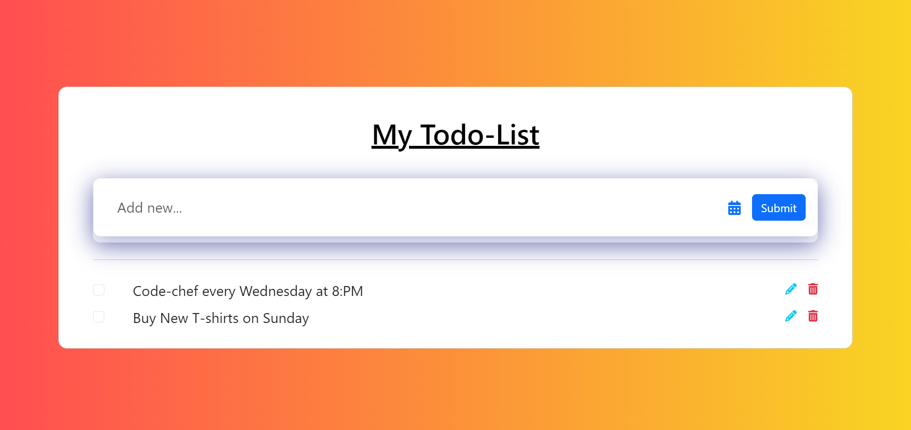

# Todo-List

## Table of Contents

* [General Info](#general-information)

* [Technologies Used](#technologies-used)

* [Screenshots](#screenshots)
## General Information
- My Project is To-do list... 
- In My project a User can
- Add a to-do Task 
- Delete a To-do Task
- Update a To-do Task
## Technologies Used
- Flask
## Screenshots

